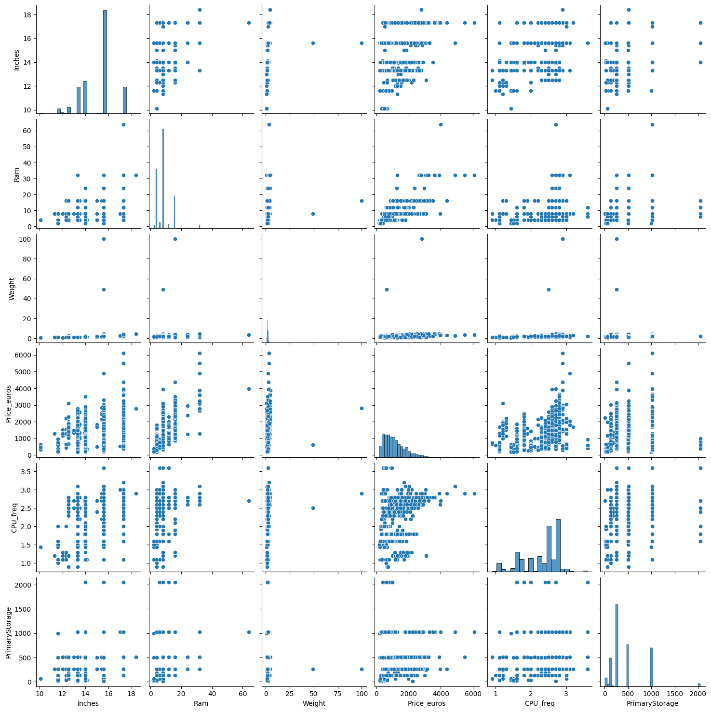
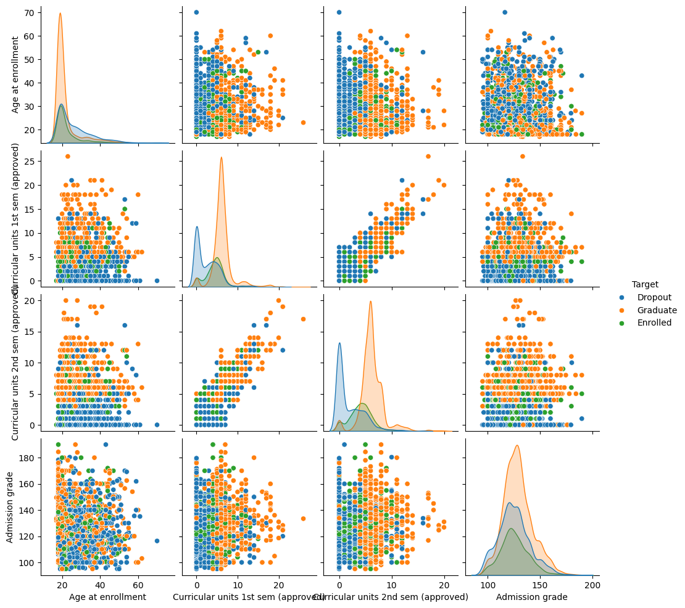

# 💻 Laptop Price Prediction & 🎓 Student Success Classification


This project was developed as part of the **Principles of Data Science** course. It applies **machine learning workflows** to real-world datasets for **regression** and **classification tasks**, including **data cleaning, feature engineering, model development, and evaluation**.

---

## 📌 Project Overview

The project consists of **two main tasks**:

### ✅ Task 1: Laptop Price Prediction (Regression)
- **Goal:** Predict laptop prices using specifications like brand, processor type, RAM, storage, and screen size.
- **Dataset:** Post-processed Kaggle laptop price dataset.
- **Models:**
  - Linear Regression
  - Ridge Regression *(Best performer)*
  - Decision Tree Regression
- **Evaluation Metrics:** MSE, R² Score  
- **Key Result:** Ridge Regression achieved the best performance with **R² = 0.846**.

---

### ✅ Task 2: Student Success Classification
- **Goal:** Predict whether a student will **graduate (success)** or **drop out** using academic and demographic features.
- **Dataset:** UC Irvine Student Academic Performance dataset.
- **Models:**
  - Logistic Regression *(Best performer)*
  - KNN
  - Naïve Bayes
- **Evaluation Metrics:** Accuracy, Precision, Recall, F1-score, Confusion Matrix  
- **Key Result:** Logistic Regression achieved the highest accuracy at **88.45%**.

---

## ✨ Features
- **Data Preprocessing:** Missing value handling, one-hot encoding, feature scaling.
- **Exploratory Data Analysis (EDA):** Correlation analysis, visual insights.
- **Model Development:** Regression and classification using `scikit-learn`.
- **Visualization:** Charts and plots with `matplotlib` and `seaborn`.

---

## 📂 Project Structure
```
├── dataset/                   
├── notebook/              # Jupyter notebook
│    ├── Project_Reg_Class.ipynb
├── report/
│    ├── Project_Report.pdf
├── visuals/                 # Visualizations for README
├── requirements.txt
└── README.md
```

---

## ▶️ How to Run

### 🔹 Installation
Clone the repository and install dependencies:
```bash
git clone https://github.com/your-username/laptop-student-prediction.git
cd laptop-student-prediction
pip install -r requirements.txt
```

### 🔹 Run Jupyter Notebooks
```bash
jupyter notebook notebooks/regression.ipynb
jupyter notebook notebooks/classification.ipynb
```

---

## 📊 Results Summary

### **Regression Results**
| Model              | MSE         | R²       |
|--------------------|------------|---------|
| Linear Regression  | 91,789.90  | 0.79063 |
| Ridge Regression   | 67,523.38  | 0.84598 |
| Decision Tree      | 122,744.61 | 0.72002 |

### **Classification Results**
| Model              | Accuracy  |
|--------------------|-----------|
| Logistic Regression| 88.45%   |
| KNN               | 84.60%   |
| Naïve Bayes       | 34.20%   |

---

## 📈 Visualizations


<!--  -->

*(Add images to the `images/` folder and replace these placeholders.)*

---

## 📄 Reports
- 📑 [Project Report (PDF)](report/Project_Report.pdf)

---

## 🛠 Built With
- **Python 3.8+**
- pandas • numpy
- scikit-learn
- matplotlib • seaborn

---

## 📜 License
This project is licensed under the **MIT License**.

---

## 👤 Author
**Your Name**  
📧 [Email](mailto:your-email@example.com) | 🌐 [Portfolio](#) | 💼 [LinkedIn](#)
